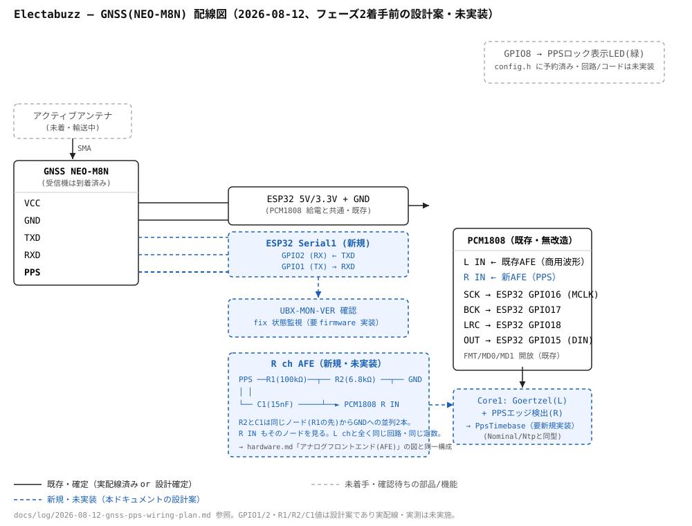

# ハードウェア構成

```
[トランス式AC出力アダプタ AC12V]
        │  (完全絶縁 — 商用電源に一切配線しない)
        ▼
  [AFE: 分圧 + Vcc/2バイアス + 2次LPF fc≈1.5kHz + TVSクランプ]
        │
        ├────────────────► PCM1808 L ch ┐
                                         ├─ I2S DMA ─► [ESP32-S3]
[GNSS NEO-M9N] ──1PPS───► PCM1808 R ch  ┘              │ Core1: 位相推定
        └────────────────► UART (fix状態) ──────────────┤ Core0: 送信/WiFi/TLS
                                                        │
                                              [LittleFS spill]
                                                        │
                                        WiFi → 既存 ingest Lambda URL → S3
```

## AC入力: トランス式AC出力アダプタ (部品調達を確定)

コンセントに挿すだけで完全絶縁、商用電源に一切配線しない。安全性がこれを選ぶ十分な理由。
鉄心トランスは一次側波形をそのまま縮小して出す。**出力は1.8mケーブル + 5.5×2.1mm
バレルプラグ**で出てくるので、基板側は DCジャックを1個載せるだけ。
**AC側の配線作業が完全にゼロになる。** これが安全設計上の最大の利点。

> 筐体には「このジャックはACである」と明記しておくこと。シルクは DC ジャックなので
> 将来の自分が必ず混乱する。

### スイッチング式を弾く判定基準

**スイッチング式のAC出力品は波形を作り直しているので測定対象にならない。**
データシートから機械的に判定できる。

| 判定 | トランス式 | スイッチング式 |
|---|---|---|
| **入力電圧定格** | **単一値**(120V のみ / 240V のみ) | **ワイドレンジ**(90〜264V) |
| 出力 | AC | 主に DC |
| 重量 | 6VA で 200g 超 | 6VA で数十g |
| 安全規格 | IEC/EN/AS-NZS **61558-2-6**(安全隔離変圧器) | 62368-1 等のみ |

入力電圧が単一定格であることが最も確実な指標だ。ワイドレンジ入力は整流・平滑して
スイッチングしない限り実現できない。Triad の同社内でも **WAU 系(AC-AC, 120V単一) は
トランス、WSU 系(AC-DC, 90-264V) はスイッチング**とはっきり分かれている。

### 検討した具体的部品

**候補1: Ideal Power 77DA-12-xy シリーズ — これを買え → 調達済み・現物で確認**

> **実物のラベル(2026-08 入手)**
> `MODEL NO.: DA-12-09` / `INPUT: 120VAC 60Hz 18VA` / `OUTPUT: 9VAC 1.33A 12VA` /
> `cULus LISTED E149474` / `VI 115V` / **`CLASS 2 TRANSFORMER`** /
> 製造 TDC POWER PRODUCTS CO., LTD.
>
> **判定: 正しい品。** 決定的なのは3点。
> 1. **`CLASS 2 TRANSFORMER` と明記されている。** UL は「Class 2 transformer」と
>    「Class 2 power supply / power unit」を区別する。**スイッチング品なら後者になる。**
>    これは推定ではなくメーカー自身の申告で鉄心トランスだと言っている
> 2. **入力が 120VAC 60Hz の単一定格。** ワイドレンジでない = 整流+スイッチングをしていない
> 3. **入力 18VA に対し出力 12VA(効率67%)。** スイッチング品なら85%超。
>    リニアトランスの数字である
>
> 出力 9VAC / 1.33A も設計書で選定した 77DA-12-09 と完全一致(`77` は流通側の
> シリーズ接頭辞で、筐体ラベルは `DA-12-09`)。

[データシート](https://www.idealpower.co.uk/product-data/product_datasheets/77da-12-xy/ideal%20power%2077da-12-xy%2012va%20us%20plugtop%20series.pdf)の実測内容:

| 項目 | 値 |
|---|---|
| 入力 | **120 VAC / 60 Hz**(データシートは typical のみ記載、min/max 空欄) |
| プラグ | **"Direct US Fixed Plugtop" = NEMA 1-15P** |
| 安全規格 | **UL 1310**、cULus, RoHS, REACH, Level VI, (EU) 2019/1782 |
| 重量 | **310 g** |
| 寸法 | 77 × 49 × 40 mm |
| 出力 | 1.8m ケーブル + **5.5 × 2.1 × 12mm バレルプラグ** |
| 動作温度 | -10 〜 +40 °C |

**日本の JIS C 8303 2ピンは NEMA 1-15P と物理的に同一なので、そのまま壁コンセントに挿さる。**
310g・AC出力・UL 1310(Class 2 電源)の三点で鉄心リニアトランスと確定する。
Ideal Power 自身が製品カテゴリを "linear power supply" と分類している。

なおデータシートの入力欄は 120V typical のみで min/max が空欄。Ideal Power の製品ページは
シリーズを **100〜120V AC 60Hz** と記載している。いずれにせよ **100V は定格以下**なので
安全側であり、励磁が軽くなって波形が綺麗になる方向に働く。

**出力電圧の選び方: どれでもよい。**

| 型番 | 出力 | 100V入力時 | 振幅 |
|---|---|---|---|
| 77DA-12-3.5 | 3.5 VAC / 3.43 A | 2.9 V | 8 Vpp |
| 77DA-12-06 | 6 VAC / 2 A | 5.0 V | 14 Vpp |
| 77DA-12-7.5 | 7.5 VAC / 1.6 A | 6.3 V | 18 Vpp |
| **77DA-12-09** | **9 VAC / 1.33 A** | **7.5 V** | **21 Vpp** |
| 77DA-12-12 | 12 VAC / 1 A | 10 V | 28 Vpp |
| 77DA-12-15 / -18 / -20 / -22 / -24 | 15〜24 VAC | 12.5〜20 V | 35〜56 Vpp |

ADC の手前で分圧するので、**どれを選んでも ADC が見る振幅は同じになり SNR も変わらない。
価格と在庫で決めてよい。** 強いて言えば 6〜12V が分圧比が素直で、分圧上段の抵抗値が
小さく済むぶんノイズ拾いと LPF 設計が楽。24V でも動く(分圧比が大きくなるだけ)。
VA定格(12VA)は負荷が µA オーダーなので完全に過剰で、選定基準にならない。

### 周波数定格: 60Hz定格品を 100V/50Hz で使う件 (設置先は50Hz地域)

77DA は **120V/60Hz 定格**だが、設置先は 100V/50Hz である。定格外の使い方になるので、
安全性と測定品質の両面を分けて評価する。

**まず測定品質には一切影響しない。** 無負荷のトランスを電圧センサとして使う場合、

```
Φ = (1/N₁)∫V₁ dt        磁束は一次電圧の積分で決まる
V₂ = N₂ dΦ/dt = (N₂/N₁)·V₁    二次開放電圧は一次電圧の忠実な相似形
```

**この関係は鉄心の飽和状態に依存しない。** 飽和が変えるのは励磁電流(透磁率)であって
電圧伝達ではない。したがって磁束が高くても出力波形は歪まず、位相推定の確度に影響しない。
**50Hz の懸念は発熱と唸りだけの話に還元される。**

**次に磁束密度。** B ∝ V/f なので、120V/60Hz 定格を基準にすると

| 条件 | V/f 比 | 定格比 |
|---|---|---|
| 定格 120V/60Hz | 2.00 | 1.00× |
| 米国上限 132V/60Hz (+10%) | 2.20 | **1.10×** ← メーカーが耐えると保証している点 |
| **設置条件 100V/50Hz** | **2.00** | **1.00×** |
| 国内上限 107V/50Hz (101±6V) | 2.14 | 1.07× |

**ちょうど定格の設計点であり、メーカーが米国高線電圧で保証している 1.10× より内側に収まる。**
国内の電圧上限でも 1.07× で、まだ内側だ。

**鉄損は 50Hz の方が小さい。** 同じ磁束密度なら、ヒステリシス損 ∝ f·B^1.6 で 0.83倍、
渦電流損 ∝ f²·B² で 0.69倍。しかも負荷は µA オーダーの無負荷運用なので銅損は励磁電流分だけ。
**熱的には 120V/60Hz で使うより楽になる。**

**結論: 77DA を 100V/50Hz で使ってよい。** そして**これは実測で確定した(下記)。**

## 現物検証ログ (2026-08-03、100V/50Hz、無負荷)

**通電 12:48 → 13:48。周囲温度 30℃(真夏の室内、= 年間の最悪条件)。**

| 検証項目 | 結果 | 判定 |
|---|---|---|
| **温度上昇** | **検出限界以下。** 1時間後、床・室温と区別がつかない。手触りは「ひんやり」 | **合格** |
| **唸り** | 耳を筐体に密着させてやっと聞こえる 100Hz。**濁りのない澄んだ音** | **合格** |
| **波形** | **素直な正弦波。** クリップ・整流痕・飽和の折れ曲がり無し | **合格** |
| 無負荷出力 | **オシロ(DSO138): Vpp = 29.61V(3回で 0.01V 以内)。DMM(HIOKI 3244-60): 10.3 VAC = 29.1 Vpp** | 想定より高い |

**三つの独立した物理量が同じ結論を指した。** 音・熱・波形はいずれも磁束密度の指標であり、
どれも「磁束は線形領域の余裕ある位置にある」と言っている。設計書の V/f = 1.00× という
机上計算が、三方向から裏付けられた。

**温度は熱量計として読める。** 熱抵抗 ≈ 6 K/W に対し ΔT が検出限界(1〜2K)以下ということは、
**無負荷損失は 0.2W 未満**である。鉄損は B のおよそ2乗で効くので、これ自体が磁束の低さの
定量的な上界になっている。

熱時定数 ≈ 15分に対し1時間は約4時定数、**98% 平衡に到達済み。追加の観測は不要。**

> **「ひんやり」は室温より冷たいという意味ではない。** プラスチックは空気より熱伝導が
> 良いので、同温でも手から熱を速く奪う。**筐体が完全に周囲温度と同じ(ΔT ≈ 0)である証拠**
> であり、期待できる最良の結果。

> **30℃ の周囲温度で通したことに意味がある。** 真夏の室内は年間で最も条件が悪い。
> **ここで通れば一年中通る。** 冬に試験しても夏の保証にはならないが、逆は成立する。

**24/7 常設運用の熱的な懸念は無い。** 下記の代替案(50Hz定格品・プラグ変換)は不要になった。

## 手持ち測定器の信頼度 (この計画を通じた運用方針)

上記の測定は QUIMAT の DSO138系オシロ(安価品)で行った。**同じ信号を3回測った結果から、
何を信じて何を捨てるべきかが確定したので方針として残す。**

| 読み | 実測での挙動 | 方針 |
|---|---|---|
| **Vpp の再現性** | 3回で 29.60 / 29.61 / 29.61 | **信じる** |
| **波形の形** | 3回とも同じ正弦波 | **信じる**(粗大な歪みの有無のみ) |
| Vpp の絶対値 | 垂直未校正、±5〜10%見込み | **DMM で裏を取る** |
| DC レベル (Vavr) | 10.54 → 8.51 → 8.92 と漂流 | **捨てる**(下記) |
| **周波数** | **50.049 / 51.334 / 50.050 Hz** | **絶対に使うな** |

**原則: 安価な測定器は絶対確度より再現性がずっと良い。比較と形状に使い、絶対値には使うな。**
**役割分担 — 振幅の絶対値は DMM、波形の形はオシロ。**

**DC オフセットが器械側である証明。** Vavr が漂流する一方 **Vpp は 0.01V も動かない**。
さらにトランス二次側には直流経路が存在せず、DC を作れない。裏付けとして
Vrms = √(DC² + AC²) が成立する: √(8.51² + 10.47²) = 13.49 に対し表示 13.38。
**つまり真の AC 実効値は約 10.5V で、残りは器械のゼロ点ずれ。**

**周波数表示が壊れている証拠。** 同一信号で 1.3Hz ばらついた上、**一画面内で Freq(51.334Hz)・
Cycl(0.019s ≒ 52.6Hz)・PW/Duty(≒55Hz) が互いに矛盾**していた。51.334 が出たのは 10ms/div、
つまりバッファ内の周期数が最少の設定である。

> **これは本設計の存在理由の実演になっている。** 手元の測定器は **1mHz の分解能を表示
> しながら 1Hz を保証できない**。設計書の「自分の確度を示せない測定器は測定器ではない」
> がそのまま目の前にある。GNSS で目盛を規正する構成は、この溝を埋めるためにある。

**副次的な確認: 絶縁の配当。** オシロのクリップを何も考えずに出力へ繋げたのは、
**トランスで絶縁されているから**である。オシロの BNC 外筒は USB 給電なら PC 経由で接地に
繋がっており、代替A(ZMPT101B を AC100V に直結)を採っていたら**同じ操作が接地への短絡**に
なっていた。「測定器を気軽に当てられる」ことが、絶縁を選んだ判断の実際的な意味だ。

## DMM の選定 (2026-08-03 決定: HIOKI 3244-60)

**この用途で DMM の確度はほとんど問題にならない。** 位相推定は振幅に依存せず、
`v_rms_mv` も ±10% の閾値判定に使うだけ。**確度ではなく安全定格と寿命で選ぶ。**

| | HIOKI 3244-60 ← **採用** | OHM TST-TDR202B | OHM TST-KJ830B |
|---|---|---|---|
| CAT定格 | III 300V / II 600V | III 300V / II 600V | **記載なし** |
| 電流測定 | 無し | 無し | **有り(200mAヒューズのみ)** |
| カウント | 4199 | 1999 | 1999 |
| 検波 | 平均値整流 | — | — |

- **True RMS は不要。** 測る対象が正弦波なので平均値整流で誤差が出ない
- **電流端子が無いことは半分メリット。** DMM 破損と事故の最大要因である
  「電流モードのまま電圧を当てる」が構造的に起こり得ない。ヒューズの真贋を心配する
  必要もなくなる。電流が要る場面(バッテリー駆動時間の実測)は **USB電力計**の方が適任
- **CAT II 600V はコンセント測定のための定格。** 分電盤は CAT III で、住宅の 100/200V なら
  CAT III 300V で足りる

> **却下した TST-KJ830B について。** 型番の "KJ830" は **DT-830B**、すなわち最も普及した
> 超安価中国製設計そのもの。電流モードを持ち保護は 200mA ヒューズ1本、そして **CAT定格の
> 記載が無い**。同じオーム電機がカード型には CAT を明記していることが、この欠落の意味を
> 教えている。
>
> **教訓: 「HIOKI か Sanwa なら安心」は成立するが、「日本メーカーのブランドなら安心」には
> 広がらない。** オーム電機は計測器メーカーではなく家庭用品ブランドで、同じ看板の下に
> 本物のカード型と DT830 の焼き直しが並んでいる。**判断はブランド単位ではなく製品単位で、
> 見るべき箇所は CAT定格の記載の有無。書いていないこと自体が情報だ。**

## DMM 到着後に測ること (残タスク)

1. **トランス無負荷出力** — 10.5 VAC 前後の想定。**分圧比はこの値で確定させる**
2. **壁コンセント電圧** — 好奇心ではなく**二つの計算を閉じるため**。
   巻数比 9/120 から、壁が 103V なら全負荷相当 7.7V、105V なら 7.9V。実測 10.5V に対する
   **無負荷上昇率が 33% か 40% かが確定**する。同時に**磁束の余裕**(100V で 1.00×、
   107V で 1.07×)がどこにいるかも数字で言える

> **ただし分圧設計は DMM を待たなくてよい。** 29.6 Vpp に ±10% の不確かさがあっても、
> 元よりヘッドルームを取る設計なので吸収される(回路図は 34Vpp 想定でフルスケール70%)。

> **出力電圧のランクを上げても励磁は軽くならない。** 77DA-12-xy は**全型番で一次側が
> 同じ 120V 巻線**なので、磁束は二次側の出力電圧の選択に**一切依存しない**。
> **磁束は一次側で決まる。** 二次側の型番違いに飽和余裕を期待するな。

**もし熱・唸りで不合格だった場合の代替**

50Hz 定格品を使えば磁束は劇的に下がるが、プラグ形状が全滅する。

| 型番 | 定格 | 100V/50Hz での磁束 | プラグ |
|---|---|---|---|
| 77DS-06-xy | 240V/50Hz | **0.42×**(極めて保守的) | 豪州 AS/NZS 3112 ✗ |
| 77DB-12-xy | 240V/50Hz | 0.42× | 英国 BS 1363 ✗ |
| 77DE-12-xy | 230V/50Hz | 0.43× | 欧州 CEE 7 ✗ |

プラグトップはトランスがプラグ筐体に内蔵されているので**プラグの付け替えができず、
変換アダプタが必須**になる。24/7 常設で travel adapter を最弱点に抱えるのは避けたいので、
これは最後の手段。その場合は後述の代替A(密閉筐体 + PSE電源コード)の方が筋がよい。

なお **Triad WAU 系は型番によって 50/60Hz 対応**のものがある(一方 `WAU060-2000` は
"primary 120V, 60Hz")。Triad を採るなら**個別型番のデータシートで周波数定格を確認する**こと。

**候補2(却下): Ideal Power 77DS-06-12 — 電気的には理想、プラグが日本で使えない**

[データシート](https://www.idealpower.co.uk/product-data/product_datasheets/77ds-06-xy/ideal%20power%2077ds-06-xy%206va%20aus%20plugtop%20series.pdf)の実測内容:

| 項目 | 値 |
|---|---|
| 入力 | **240 VAC / 50 Hz(単一定格)** |
| プラグ | **"Direct Australia Fixed Plugtop" = AS/NZS 3112** |
| 出力 | 12 VAC / 0.5 A / 6 VA |
| 安全規格 | **AS NZS 61558-2-6 / AS NZS 61558-1**、CE, RoHS, REACH, Level VI |
| 重量 | **220 g** |
| 寸法 | 70 × 43 × 55 mm |
| 出力 | 1.8m ケーブル + 5.5 × 2.1 × 10mm プラグ |

判定: **中身は正しい。** 220g・AC出力・61558-2-6 の三点で鉄心の安全隔離変圧器と確定する。
「トランスとヒューズだけ」という観察は正しい。

**しかしプラグが豪州の AS/NZS 3112(斜め二枚刃+アース)で、日本の JIS C 8303 には
物理的に挿さらない。** これが唯一かつ致命的な問題。変換アダプタを噛ませれば動くが、
24/7 常設で travel adapter を最弱点として抱えるのは避けたい。

なお**電気的には日本の100Vでも問題なく、むしろ好都合**である。参考として記録しておく。

- 巻数比 240:12 なので 100V 入力で出力 **5.0 VAC**。周波数測定に振幅の絶対値は不要で、
  分圧段が楽になるだけ
- **設置先の 50Hz にそのまま合致する 50Hz 定格品**であり、励磁は定格の 42% に留まる。
  磁束の余裕という一点だけで見れば 77DA より優れている(→ 前掲の周波数定格の節を参照。
  77DA も 1.00× でメーカー保証範囲の内側なので、この差は余裕の大小の話に過ぎない)

**候補3(代替): Triad Magnetics WAU120-1000**

77DA が在庫切れのときの代替。同じく NEMA 1-15P で日本の壁コンセントに挿さる。
[DigiKey 5977832](https://www.digikey.com/en/products/detail/triad-magnetics/WAU120-1000/5977832) の実測仕様:

| 項目 | 値 |
|---|---|
| 入力 | **120 VAC(単一定格)** |
| プラグ | **NEMA 1-15P, Fixed Blade** |
| 出力 | **12 VAC / 1 A** |
| 出力コネクタ | バレルプラグ 5.5 × 2.1 × 11.0 mm |
| 無負荷消費 | 210 mW (Max) |
| 効率 / 承認 | Level VI / cULus |
| 寸法 | 48 × 60 × 80 mm |

100V 入力なら出力は 12 × 100/120 = **10 VAC**。

磁束の事情は 77DA と同一(100V/50Hz で 1.00×)。ただし **WAU 系は型番によって 50/60Hz
対応のものがある**ので、50Hz 定格が明記された型番を引ければ 77DA より余裕が出る。
`WAU060-2000` は "primary 120V, 60Hz" と 60Hz 専用なので、**必ず個別型番のデータシートで
周波数定格を確認すること。**

### PSE について

77DS は AS/NZS 認証、WAU は cULus。**どちらも日本の PSE ではない。** DigiKey は技術用途で
非PSE品を扱っており、個人の実験・自家使用は問題にならないが、常設24/7運用にするなら
承知の上でやること。PSE付きが要るなら国内のインターホン用トランス(AC16V等)が候補になる。

### VA定格と無負荷電圧

負荷は分圧抵抗だけなので µA オーダー、実質**無負荷運用**になる。6VA でも 12VA でも過剰で、
VA定格は選定基準にならない。ただし**無負荷時の出力電圧は定格より高く出る**(レギュレーション分、
リニアトランスなら +10〜20%)。分圧比は無負荷電圧を基準に設計すること。

### トランスの位相特性は無害 (確認事項)

累積位相を第一級データにする設計なので、トランスの位相特性を検討しておく。

- 位相シフト(数度)は**定数なので時間微分でゼロになる**。瞬時周波数には効かない
- 温度で位相が 10° ドリフトしても TE への影響は 0.028 サイクル = 60Hz で **0.46 ms**。
  秒オーダーの系統時刻偏差に対して完全に無視できる
- 励磁電流由来の高調波歪みは単一ビンDFTが除去する。上記の通り低励磁運用なので元々小さい

結論: 問題なし。トランスは周波数測定の誤差要因にならない。

### 代替案

- **代替A: ZMPT101B 等の計器用電圧トランス基板。** 入手容易・安価だが一次側を AC100V に
  配線する。採るなら PSE取得済み電源コード + ヒューズ + 完全密閉筐体 + 沿面距離確保を
  必須条件に
- **代替B: 非接触 E-field ピックアップ。** 完全非接触で最も安全だが、周辺インバータ機器や
  別相の干渉で SNR が設置環境依存になる。主案が採れないときの逃げ道

## アナログフロントエンド (AFE)

> **実測値(2026-08-03、無負荷、QUIMAT DSO138系オシロ)**
> **Vpp = 29.61 V**(0.1s/div・10ms/div・20ms/div の3回で 29.60〜29.61、**0.01V しかブレない**)。
> オフセットを除いた実効値は **約 10.5 VAC**。波形は**素直な正弦波**でクリップ・整流・
> 飽和由来の歪みは無し。
>
> **当初見積り(8〜9 VAC / 25 Vpp)より高い。分圧比はこの実測値から引く。**
> 無負荷での電圧上昇が想定より大きかった(定格 9VAC@120V → 100V換算 7.5V に対し +40%)。
> 12VA の小型リニアトランスとしてはあり得る範囲で、実際の壁電圧が 103〜105V なら更に自然。
>
> **ただしオシロの垂直確度は未校正(±5〜10%見込み)。振幅の絶対値はテスタで裏を取ること。**
> DMM(HIOKI 3244-60)で再測定(2026-08-04)。実効値 **10.3 VAC** = 29.1 Vpp。
> オシロ値との差 0.5 Vpp はヘッドルーム内で吸収される。分圧設計は変更なし。
>
> 参考: 同じオシロの周波数表示は 50.049 / 51.334 / 50.050 Hz と **1.3Hz ばらついた**上、
> 一画面内で Freq・Cycl・Duty が互いに矛盾していた。**周波数は一切信用するな。**
> (これ自体が本設計の存在理由の実演になっている: 1mHz を表示しながら 1Hz を保証できない)

無負荷出力は実測 **10.3 VAC (DMM 確度)、振幅 29.1 Vpp**。これを PCM1808 のレンジに落とす。
(型番を変えたら振幅表に従って分圧比だけ引き直せばよい。回路構成は同じ)

```
   AC出力(バレルジャックの信号側端子)
        │
        ├── R1(100kΩ) ──┬── R2(6.8kΩ) ──┬── GND   分圧: 34Vpp → フルスケールの約65〜72%
        │                │                │
        │              [TVS]              │        クランプ(サージ・雷サージ対策・未確定)
        │                │                │
        │                └─ C1 ───────────┴──► PCM1808 Lch   受動1次RC(15nF確定)、fc≈1.84kHz
```

**Vcc/2 バイアス網は無くなった**（2026-08-07、DMM実測でモジュール側が自己バイアス
できていると確定したため。下記参照）。C1 は Sallen-Key(要OPアンプ)ではなく
node A から GND への**コンデンサ1個の受動1次RC(15nF、2026-08-08確定)**で足りた(下記)。

**バレルジャックの2端子はどちらもAC(トランス二次巻線の両端)で、あらかじめGND電位に
決まっている端子は無い。** 二次側は一次側(商用電源)から絶縁されたフローティング巻線
なので、どちらの端子を基準に取ってもよい。**もう一方の端子(リターン側)は回路のGND
(ESP32のGNDと共通)に直結し、それを0V基準にする。** これでPCM1808のL IN(シングルエンド
入力)がGNDに対する電位差として波形を読める。**絶縁トランス越しである以上、二次側の
どちらを回路GNDに落としても安全性は変わらない**(→上でオシロのクリップを気軽に当てられた
のと同じ理屈)。

設計方針:

- **分圧はフルスケールの 60〜75% に収まればよい。ぴったり狙うな。**
  PCM1808 のフルスケール入力は **0.6 × VCC**（データシート値。`ANALOG INPUT` 電気特性:
  Input voltage = 0.6 VCC Vp-p、Center voltage(VREF) = 0.5 VCC、Input impedance = 60kΩ(typ.)。
  `Recommended Operating Conditions` の VCC=5V 行にも "Analog input voltage, full scale = 3Vp-p"
  と明記があり 0.6×5V と一致する）。

  **`VCC` は ESP32 の `5V` ピンから取ると決めた。** USB VBUS からショットキー1個ぶん落ちるため、
  実測は **4.84V**（2026-08-05、テスタ）で公称 5V ではない。フルスケールは実測ベースで
  **2.904 Vpp**。

  効いている制約は**クリップしないこと**だけで、超えた瞬間に位相推定が壊れる一方、
  **下に振れて困ることは実質ない**（24bit ADC で何万周期も積む単一ビン DFT だ。
  SN 比はここでは律速しない）。**迷ったら低い方へ振れ。** 避けるのは 75% を超える側だけだ。

  **R1 = 100kΩ、R2 = 6.8kΩ(どちらも E24 標準品)に確定。** 分圧比 k = R2/(R1+R2) ≒ 0.0637。
  **ADC の入力インピーダンス 60kΩ(typ.) が R2 と並列に効く**ため、実効分圧比は k ≒ 0.0576 まで
  下がる。設計上のワーストケース入力 34Vpp に対し、**VCC 実測 4.84V** 基準では素の分圧比で
  FS比 74.5%、ADC 負荷込みで FS比 67.4%。実測の無負荷出力 29.1Vpp では FS比 57.7〜63.8%。
  **公称 VCC=5V で計算していた段階(72%/65%)より、実測 4.84V ではワーストケースの上限が
  75% の天井にやや近づくが、いずれもクリップまでの余裕は残る。** R1 を 100kΩ 側に寄せたのは
  万一の異常時の電流制限を優先したため

  検討したが採らなかった案（E12 で他の比を組む場合の目安。VCC=4.84V 基準、ADC 負荷抜き）:

  | R1 | R2 | 比 | FS 比 |
  |---|---|---|---|
  | 68k + 68k | 10k | 1/14.60 | 69.8% |
  | 150k | 1k + 10k | 1/14.64 | 69.6% |
  | 100k + 47k | 10k | 1/15.70 | 64.9% |

  **2026-08-07、実配線での確認が済んだ。** L INでの振幅は`l_pp`実測からフルスケールの
  約48%（≈1.4Vpp）で、DMM実測(L IN直接、約0.6VAC)とも整合。クリップの余裕は設計通り
  残っている。**ただしトランス接続直後の数分間、C1(LPF)が未実装のハイインピーダンス
  ノードが広帯域ノイズを拾ってフルスケールに張り付く挙動が出た**（定常値ではなく
  ノイズのピーク、R1=100kΩの電流制限のおかげで破壊リスクはない。→
  [log/2026-08-07-fs-wiring-verification.md](log/2026-08-07-fs-wiring-verification.md)）。
  **2026-08-08、C1(15nF)実装後の再測定でこのノイズ挙動が消えたことを確認した**
  （フルスケール張り付きの再発なし、THD 0.0%を維持。→
  [log/2026-08-08-c1-lpf-verification.md](log/2026-08-08-c1-lpf-verification.md)）
- **`VCC` を変えたら分圧比も引き直せ。** フルスケールが `0.6 × VCC` で決まる以上、
  電源の取りかたと AFE の抵抗値は**独立に決められない**
- 一次側に R1 を大きく取り(数十kΩ〜100kΩ)、万一の異常時にも電流が流れない設計にする
- **LPF(C1)は15nF(E24、表示コード`153`)の受動1次RCで確定した**（2026-08-08）。
  Sallen-Key の 2次案は当初 OP アンプ前提だったが、**急峻さは要らない**(次項)上に
  **Vcc/2 バイアス網も不要と確定した**(下記)ため、OP アンプを要る理由が両方とも消え、
  **node A→GND にコンデンサ1個の受動1次RC**で足りた。今の分圧網
  (R1=100kΩ・R2=6.8kΩ・ADC入力≈60kΩ)から見た実効抵抗は
  R_eff = 1/(1/100k+1/6.8k+1/60k) ≈ 5.76kΩ で、fc≈1.5kHz(元の目標値)を狙うなら
  C ≈ 1/(2π·fc·R_eff) ≈ 18nF(E24で15〜22nF)が計算値。**在庫にあった15nF(範囲の下限)を
  そのまま採用**——fcは1/(2π·5.76kΩ·15nF)≈1.84kHzとやや高めに出るが、50Hzでの位相シフトは
  `arctan(50/1840)≈1.6°` の固定値で、内蔵HPFの1.045°と同じ理屈で無視できる。
  **実配線での再測定でクリッピング(フルスケール張り付き)の消失とTHD 0.0%維持を確認済み**
  （→ [log/2026-08-08-c1-lpf-verification.md](log/2026-08-08-c1-lpf-verification.md)）。
  **TVS(サージ対策)は引き続き別枠の未確定事項**——コンデンサでは代替できない
- LPF はアンチエイリアス用。**単一ビンDFTが高調波を除去するので急峻さは不要**。
  既存の地震計が `kOversample=10` のボックスカー平均で代用していた役割を、
  ここでは本物のアナログフィルタが担う
- PCM1808 は DC 除去の HPF を内蔵するのでバイアスは厳密でなくてよい。
  **コーナーは `0.019 fS / 1000`**（データシート値。`fs = 48kHz` で **0.912 Hz**）で、
  50Hz への位相進みは `arctan(0.912/50) = 1.045°` = **58 µs の固定オフセット**。
  **定数なので周波数(位相の微分)には効かず、時刻偏差に対しても無視できる**
  （測っているのは秒オーダーの量だ）。デジタルなので温度でも動かない。**実測は不要**
- **手元のモジュールは入力が電解コンデンサで AC 結合されている。**
  **2026-08-07、DMM でモジュール入力(node A)の DC 電位を実測: 数mV(ほぼ0V)。**
  外側のパッドは分圧網(R2→GND)の電位がそのまま出ており、モジュール側が外部パッドまで
  独自バイアスを引き出してはいない。同日の実配線確認で THD 0.0%・振幅の片側クリップ無し
  という綺麗な波形が取れていることも合わせると、**チップ内部(電解コンデンサの向こう側)が
  自己バイアスできていると判断できる。上図の `Vcc/2` バイアス網は不要と確定した**
  （→ [log/2026-08-07-gridfreq-test-mode.md](log/2026-08-07-gridfreq-test-mode.md)）

## PPS チャンネルは意図的に帯域制限する

u-blox の 1PPS は 3.3V CMOS、既定でパルス幅 100ms。R ch に入れる際は分圧するが、
**ここで生の矩形波をそのまま入れてはいけない。** ナイキストを超える成分がエイリアスして
エッジ位置の推定を汚す。

正しい設計は **L ch と同じ fc で意図的に帯域制限すること**。帯域制限された既知の波形は
エッジが滑らかなランプになり、**サンプル間補間が数学的に well-defined になる**。
これでサンプル周期以下の分解能が正当に得られる。

48kHz なら 1サンプル = 20.8µs。帯域制限エッジのフィッティングでその 1/100 まで追い込めば
PPS 1発あたり 0.2µs = 0.2ppm。1000秒回帰で sub-ppb に落ちる。

なお **48kHz は必須ではない。** フェーズ1で THD を見るためのヘッドルームとして高めに
取っているだけで、8kHz でも 1発 1ppm 相当 → 回帰後は十分。CPU が厳しければ落とせる。

## 電源 (見落としやすいが重要)

**測定装置の電源を測定対象の商用電源から直接取ってはならない。**
周波数データが最も価値を持つのは系統異常時、つまり停電の前後である。装置が対象と
一緒に落ちるとその瞬間を取り逃がす。パススルー対応モバイルバッテリーか小型UPSを挟む。
ESP32-S3 + GNSS で 1W 程度なので 10000mAh で数十時間。停電検出時(v_rms 低下)は
明示記録し、低レートモードで延命する。

> **「小型UPSを挟む」の具体案(検討中、未確定): 電源マルチプレクサIC(TPS2113A系)で
> USBパススルー+乾電池バックアップを自動切替し、ICのSTAT出力をそのままGPIOの
> 停電フラグに使う案が出ている。** 市販パススルーバッテリーと違い機械可読な
> 「今どちらの電源か」フラグを追加回路無しで得られる点が利点。方向性は妥当と判断したが、
> 昇圧コンバータの要否(ICの入力電圧下限次第で省略できる可能性)・昇圧を常時通電する
> ことによる待機中の乾電池消耗・電池種別(アルカリよりリチウム一次電池)が未検証のまま
> 残っている(→ [docs/log/2026-08-11-usb-ups-power-mux-design.md](log/2026-08-11-usb-ups-power-mux-design.md)）

## 母艦: ESP32 を採る (Pi 案との比較)

| | ESP32-S3 (採用) | Raspberry Pi |
|---|---|---|
| 既存資産の流用 | **Uploader/HmacSha256/TimeSync/Display/lambda/terraform 全部** | ingest 以降のみ |
| 欠測耐性 | 既存の退避・バックオフ・決定論的キーが完成済み | OS 機能で楽に書ける |
| 測定時刻の安定性 | **I2S DMA + 二コア分離。ハードウェア由来で堅い** | ALSA + chrony。自前設計 |
| PPS 規正 | 方式A(同一ADC)が綺麗に入る | `pps-gpio` + chrony が面倒を見る |
| 消費電力 | 1W。バッテリー延命が現実的 | 3W |

[design.md](https://github.com/nna774/NamazuHaUrokoGaNai/blob/master/docs/design.md) が「ESP32-S3 への差し替えは
軽い(board差し替え + TFTフラグ削除 + ピン戻し)」と明記している。ただし
「`gDisplay` は `#ifdef` で囲われず無条件にインスタンス化される」との指摘があるので、
LCD なし構成にするならコンパイル時フラグが必要。

> **Pi 案は「ESP32 で立ち上がらなかった場合の代替母艦」として残すだけであり、
> 第2系として並行稼働させる計画ではない。** 二重測定で相互検証する構想は採らない
> (検証は二重測定に依存しない形で組んである → [verification.md](verification.md))。

### 無印 ESP32 か ESP32-S3 か (2026-08-03 決定: S3。ただし必須ではない)

**結論を先に言う。この設計は ESP32-S3 を必要としていない。無印 ESP32 でも成立する。**
NamazuHaUrokoGaNai と同じ機器で作れる。**そのうえで S3 を採る。**

必要な機能はすべて両方にある。

| 要件 | 無印 ESP32 | ESP32-S3 |
|---|---|---|
| I2S RX の DMA・ステレオ 48kHz | 可（`SOC_I2S_NUM (2U)`） | 可 |
| 単一ビン Goertzel（FPU） | 可。48kHz で約 300 kFLOP/s と**桁で余る** | 可 |
| 二コア分離（Core0 送信 / Core1 DSP） | 可 | 可 |
| 方式B の MCPWM capture | 可（`SOC_MCPWM_SUPPORTED 1`）。**W53SA 氏の先行例はこちらで動いている** | 可（capture timer 分解能は APB 固定） |
| I2S の APLL | **あり**（`SOC_I2S_SUPPORTS_APLL (1)`） | **無い** |
| ETM | 無い | **無い**（→ [timebase.md](timebase.md)） |

**S3 を採る理由は一つだけで、MCLK の出力ピンだ。**

PCM1808 は SCKI を要求する。モジュールに缶発振器が載っていなければ ESP32 から MCLK を
出すことになるが、**無印 ESP32 の I2S MCLK 出力は GPIO 0 / 1 / 3 に限られる。**
ESP-IDF が `"only gpio 0/1/3 are supported on esp32"` とエラー文字列に書いている。

- **GPIO0 は起動時のブートストラップピン**
- **GPIO1 / GPIO3 は UART0 の TX / RX**、つまりシリアルコンソール

**どれを選んでも代償がある。** S3 は GPIO マトリクス経由で自由に回せるのでこの角が無い。

**これが効くのは、設計書が「SCKI の master を測定で決め、決めたら変えるな」としているからだ。**
無印 ESP32 で始めて、フェーズ1.5 の実測が「ESP32-as-master の方がまし」と出た場合、
**GPIO0 かコンソールのどちらかを諦める袋小路に入る。** S3 なら両方の選択肢が生きたまま残る。

**APLL が無印 ESP32 にしかないのは、判断を覆さない。** 公称値からの定数ずれは
`NtpTimebase` の回帰が吸収するので確度に効かず、安定度でどちらが勝つかは自明でない
（→ [timebase.md](timebase.md)）。

> **無印 ESP32 が余っているという事実は捨てない。** チップ非依存だと分かったので、
> **予備機・故障時の差し替え先・（将来やる気になったときの）第2系の母艦として使える。**
> 「S3 必須」と書いてしまうとこの選択肢が消えるので、**必須ではないと明記しておく。**

> **ただし `NtpTimebase` の水晶特性は本番で使う個体で測れ。**
> フェーズ1.5 の目的は「自分が乗る水晶の実 ppm と温度相関を知ること」なので、
> **余っている別の個体で測っても本番の役に立たない。開発機と本番機を分けるな。**

### 現物: ESP32-S3-WROOM-1 **N16R8** の DevKitC-1 系クローン

**16MB quad SPI flash + 8MB octal SPI PSRAM** の版。ここから2つ制約が出る。

**1. `GPIO 33 〜 37` は使えない。** モジュール内部で octal PSRAM のダイに配線されている。
**PSRAM をソフトウェアで有効化するかどうかとは無関係**で、配線は物理的に存在する。
ピンヘッダには出ていて何事もなく刺さってしまうので、**I2S のピン割り当てでここを踏むな。**
S3 を採った理由が「MCLK を好きなピンに出せること」である以上、
**その自由度が実際には 33〜37 のぶんだけ狭いことを知った上で割り当てる**必要がある。

**2. PSRAM は有効化しない。** 要らないからだ。1バッチ 424B、Goertzel の状態も数十バイトで、
**I2S の DMA バッファは内蔵 SRAM に置く必要がある**（PSRAM 上に取ると DMA が届かない）。
有効化しても速くも大きくもならず、置き場所を間違える余地が増えるだけである。
有効にするなら `board_build.arduino.memory_type = qio_opi` が要る
（R8 は octal なので既定の `qio_qspi` では起動しない）。**必要になってから足せ。**

PlatformIO の `esp32-s3-devkitc-1` は **N8（8MB・PSRAM無し）**の定義なので、
`platformio.ini` で 16MB を明示している。**教えないとパーティション表が 8MB のまま作られ、
後半 8MB が死ぬ**（黙って死ぬので気づきにくい）。

### SCKI は ESP32 の MCLK から出す。缶発振器を外付けしない

発注した PCM1808 モジュールは**缶発振器なし版**なので、SCKI は ESP32 の MCLK から供給する。
**これで足りる。缶発振器を後から外付けする改造は行わない。**

外付け自体は難しくない（12.288MHz の 3.3V 缶発振器は Vcc / GND / OE / OUT の4本で、
OUT を SCKI に入れ、`MD0`/`MD1` で PCM1808 を master にし、ESP32 の I2S を slave RX に
回すだけだ）。**やらないのは、できないからではなく、得るものが無いからである。**

**理由1: 安価な缶発振器は ±50〜100ppm で、ESP32 の水晶より悪い。**
手元の個体の実測は soak 開始時点で +3ppm 台に収まっている（仕様は ±10ppm）。
**部品を足して精度が下がるなら足す意味が無い。**

**理由2: 初期偏差はそもそも無害なので、精度の良い品を選んでも得しない。**
本設計は `fs` を定数として書かず「測って報告する量」として持つ。**何 ppm ずれていようが
測って申告すれば済む。** 効くのは偏差ではなく**温度で動く量**の方だ。

**理由3: その温度ドリフトすら方式Aが一次で相殺する。**
商用波形と PPS を同一クロックでサンプルしているので、比を取った時点で消える
（→ [risks.md](risks.md)）。PPS が来る前の期間も `NtpTimebase` が数分おきに測り直して
遅いドリフトを追う。**つまり発振器を良くして得をする区間がこの装置には存在しない。**
設計書が最初から「TCXO を積む必要もない」と書いているのはこの意味だ。

**それでも足したくなったら、先に実測を出せ。** 現物で `fs` の安定度を測り、
それが要件に届いていないと数字で言えたときにだけ正当化される。
根拠なしに部品を足すのは、**直っていない問題を直した気になるだけだ。**

**現物で確認済み（2026-08-05）: 発振器用のパッドもソケットも無い。**
やるなら空中配線になる。**なおさらやらない**（→ [log/2026-08-05-pcm1808-arrival.md](log/2026-08-05-pcm1808-arrival.md)）。

### 現物の PCM1808 モジュールと配線

シルク `PCM1808` / `SKU:013325`。**無改造・ジャンパ無しで使える。**

| 辺 | ピン（シルク順） |
|---|---|
| 上 | `BCK` `OUT` `LRC` **`SCK`** `GND` `3.3V` |
| 下 | `FMT` `MD1` `MD0` `GND` `3.3` `+5V` |
| 左 | `L IN` `GND` `R IN` |

**`SCK` が SCKI（システムクロック入力）だ。BCK と取り違えるな。**
デジタル4本には 100Ω の4連アレイが直列に入っている（終端済み）。

**`FMT` / `MD0` / `MD1` は開放にしろ。** データシートが
「Schmitt-trigger input, with 50-kΩ typical pulldown resistor」と明記しており、
開放 = すべて Low = **スレーブモード + I2S 24bit** に落ちる。**これが欲しい構成そのものだ。**
GND へ落として確定させる手もあるが採らない。**配線が増えれば間違える余地も増える。**

| MD1 | MD0 | モード | | FMT | フォーマット |
|---|---|---|---|---|---|
| **Low** | **Low** | **スレーブ (256/384/512 fS 自動判別)** | | **Low** | **I2S, 24-bit** |
| Low | High | マスタ (512 fS) | | High | 左詰め, 24-bit |
| High | Low | マスタ (384 fS) | | | |
| High | High | マスタ (256 fS) | | | |

**PCM1808 をスレーブにし、ESP32-S3 が SCKI・BCK・LRCK の3本を出す。**
PCM1808 をマスタにする構成（`fs = SCKI/256` の整数分周になる）も選べるが採らない。
**利点は `fs` の素性の良さだけで、それは ESP32 側でも MCLK と LRCK が同じ PLL から出る以上
すでに保証されている。** 踏み慣れた側でよい。

| PCM1808 | ESP32-S3 |
|---|---|
| `SCK` (SCKI) | **GPIO 16**（I2S MCLK 出力） |
| `BCK` | **GPIO 17** |
| `LRC` (LRCK) | **GPIO 18** |
| `OUT` (DOUT) | **GPIO 15** |
| `+5V` | 5V |
| `3.3V` | 3V3 |
| `GND` | GND |
| `FMT` `MD1` `MD0` | **開放** |

**電源は2系統要るが、どちらも ESP32 の DevKit から取れる。** `VCC`（アナログ）は
**4.5〜5.5V** で、モジュールにレギュレータは載っていない（**3.3V だけ与えても動かない**）。
`VDD`（デジタル）が 2.7〜3.6V。消費は `ICC` 8.6mA typ / `IDD` 5.9mA typ で USB 給電に対して誤差。

**DevKit の `5V` ピンの実測は 4.84V**（2026-08-05、テスタ）。規定の下端 4.5V に対して
余裕があり、**別電源は要らない。** ただし**フルスケール入力が `0.6 × VCC` で決まる**ので、
**電源の取りかたを変えたら AFE の分圧比も引き直すこと。**

**クロックを止めると PCM1808 はパワーダウン/リセットする**
（データシート: "Power-down and reset functions enabled by halting SCKI, BCK, LRCK"）。
I2S を停止・再開する実装を書くときに効く。**止めた区間を測れたことにするな。**

### オンボードLED・ボタン (2026-08-09 実機確認)

母艦にはAFE用の4本(GPIO15/16/17/18)以外にLED4個・ボタン2個が載っているが、
**シルクにLED側の型番・ピン表記が一切無いクローン基板**だったため、実機での
能動的なテストで正体を確定した（詳細・調査の経緯は
[log/2026-08-09-led-button-hardware-probe.md](log/2026-08-09-led-button-hardware-probe.md)）。

| 部品 | 正体 | 制御可否 |
|---|---|---|
| 白い正方形パッケージ | WS2812アドレッサブルRGB LED、**GPIO48** | `neopixelWrite(48, r, g, b)`（Arduino-ESP32コア組み込み）で制御可能。実機で色変化を確認済み |
| 常時点灯の橙〜赤 | 電源インジケータ、3V3直結 | 制御不可 |
| 残る2個 | USB-UARTブリッジのTX/RXアクティビティ表示。**ESP32のGPIOには非接続** | ファームからの制御は不可能。シリアル通信量に応じて自動点滅するだけ |
| BOOTボタン | **GPIO0**。起動完了後は`pinMode(0, INPUT_PULLUP)`で普通の入力として読める | 押下・離しの検出を実機で確認済み |
| RETボタン | `EN`直結のハードウェアリセット | ソフトウェアからは検出不可能 |

### ステータス表示LED (2026-08-09 実装・実機配線)

WS2812(GPIO48)と外付けLED4本を使ったステータス表示を実装した。設計判断の
経緯は[log/2026-08-09-led-status-feature.md](log/2026-08-09-led-status-feature.md)。

- **WS2812**: `GoertzelEstimator::cyclesQ16()`の下位16bitをそのままhueにマップする
  （実機のシンクロスコープと同じ挙動——基準周波数ぴったりなら色が静止し、
  ずれている間だけ回転する）。`kCyclesToHueGain=20`・`kWs2812Brightness=15`
  （`firmware/lib/LedStatus/`）
- **外付け4本**（GPIO4/5/6/7。基板シルク上でこの4本が隣接した1列に並んでおり
  配線しやすい）:

  | GPIO | LED色 | 意味 | 抵抗 |
  |---|---|---|---|
  | 4 | 緑 | fsがNTPでロック済み(HIGH) | 220Ω |
  | 5 | 黄 | LittleFSへのspillが溜まっている(HIGH) | 220Ω |
  | 6 | 青 | 基準周波数より速い(HIGH) | 330Ω |
  | 7 | 赤 | WiFi切断中(HIGH)。「赤=警告」の慣習に合わせ、健全時は消灯 | 330Ω |

  配線は共通: `GPIO → 抵抗 → LEDアノード(長い足) → カソード(短い足) → GND`。
  **抵抗はLEDごとに1本ずつ必要——複数LED間で共有すると、同時点灯時に電流が
  合算されて明るさが点灯本数に依存してしまう。**
  **明るさはソフトウェアでは`digitalWrite()`のフルHIGH駆動が上限**（PWMを
  使っても100%点灯を超える明るさは原理的に出せない）。より明るくしたいなら
  抵抗を下げる（150Ω程度までは安全マージン内）以外に手が無い。今回は
  220〜330Ωのままで実用上十分と判断した。

- **GPIO8はフェーズ2(PPS)の「PPSロック済み」表示用に予約済み（未実装）。**
  4/5/6/7と同じ列の続きにあり配線しやすい。PPS信号自体は既存I2SのRチャンネルに
  載る設計なので新規GPIOは不要——要るのはロック状態を示す表示用の1本だけ。
  他用途に転用しないこと。

### GNSS(NEO-M8N) 配線 — フェーズ2着手前の設計案 (2026-08-12、未実装)

**受信機は到着済み、アンテナは輸送中で未着。** アンテナが無くても確定できる範囲を
先に設計として固めておく。実配線・実測はまだで、**この節はすべて設計案**である。



- **電源**: 受信機の `VCC`/`GND` は PCM1808 と同じ ESP32 の 5V/3.3V レールから分岐する。
  新規の給電経路は要らない
- **UART**: 受信機の `TXD`/`RXD` を ESP32 の空き GPIO(候補: **GPIO1(TX)・GPIO2(RX)**。
  除外リスト — GPIO33〜37(octal PSRAM)・26〜32(flash)・43/44(コンソール)・19/20(USB)・
  0/3/45/46(ストラップ)・15〜18(I2S)・4〜8(LED) — に当たらない未使用ピン)に接続し、
  `Serial1` として使う。**用途は `UBX-MON-VER` でのチップ確認と fix 状態の監視だけで、
  `CFG-TP5`/`CFG-NAV5` の設定は u-center で一度 EEPROM へ焼けば足りる**
  （firmware が毎回設定コマンドを送る必要は必須ではない。→ 次節）
- **PPS**: **ESP32 の GPIO には繋がない。** `timebase.md` の方式Aの通り、PCM1808 の
  R ch(`R IN`)へ、L ch と**同じ R1(100kΩ)/R2(6.8kΩ)/C1(15nF)** の分圧+LPF網を新規に
  もう一組作って入れる。**同じ定数を流用するのは L ch と fc を揃えるため**
  (`timebase.md`「PPS チャンネルは意図的に帯域制限する」節)。PPS は 3.3V CMOS の矩形波で、
  振幅の絶対値は不要(PCM1808 内蔵 HPF が微分してエッジをピークに変える)なので、
  分圧比の厳密な再計算はしていない — L ch と同じ部品をもう1組買い足せば済む
- **GPIO8**(PPS ロック表示 LED)は既存の予約のまま。回路・コードとも未着手

この節の GPIO1/2・部品定数は**設計案であり実配線・実測はしていない。** 現物配線時に
`config.h` の除外リストコメントと突き合わせて確定させること。
経緯・「アンテナなしで進められる作業」の切り分けは
[log/2026-08-12-gnss-pps-wiring-plan.md](log/2026-08-12-gnss-pps-wiring-plan.md)。

---

